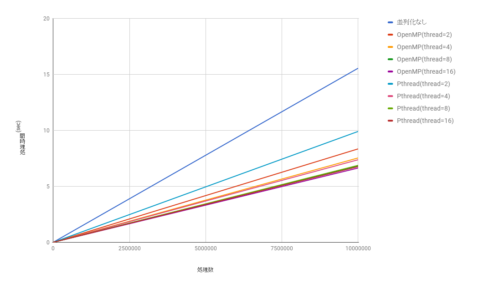

# 並列分散処理 E班

## OpenMP


 [Github](https://github.com/AnaTofuZ/ie-openmpi-E-2017)


---
## 内容

- OpenMPについて
- マージソート
- 円周率
- 素数判定
    - Pthreadとの比較
- OpenMPのアンチパターン
- まとめ

---

## OpenMPについて

+++
- OpenMP は非営利団体 
OpenMP Architecture Review Board（ARB）によって規定されている業界標準規格です。
- **共有メモリ型** 並列計算機用のプログラムの並列化を記述するための指示文、ライブラリ関数、環境変数などが規定されています。

+++

### 特徴

- Pthreadなどと比較して簡易な記述
- 基本のC言語のソースコードにあまり手をつけずに作る事が可能
- 最近のコンパイラに標準搭載され始めている
    - Macでも動くぞ!!

+++

### サンプルコード

``` C
#include<stdio.h>
#include<omp.h>

int main(){
    int a[1000];
    int b[1000];
    int c[1000];
    int i;

    #pragma omp parallel for
    for(i=0;i<1000;i++){
        a[i] = i;
        b[i] = 1;
        c[i] = a[i] + b[i];
    }

    for(i=0;i<1000;i++){
        printf("%d\n",c[i]);
    }

  return 0;
}
```
@[10](指示子を使うことで簡単に並列化出来る)

---
## 実験概要

+++

- OpenMPでの並列化の方法を何通りかで検証を行う
- 単一処理との速度比較
- またPthredを用いた場合の実装と比較し挙動の違いを確認する

+++

- 実験環境
- 10コアCPUのFedoraVMで実行

---

## マージソートを並列化する

- マージソート関数を再帰的に書く。
- その関数を各スレッドで並列実行
- 実装
	- 逐次処理
	- 再帰的に呼ぶ際にThreadを作成する並列処理
	- 同時実行分のみThreadを作成する並列処理の3種類で実行

<!--マージソートを並列化する。方法としては,マージソート関数を再帰的に書き,
その関数を各スレッドで同時実行するというもの。  
今回は,逐次処理,再帰的に呼ぶ際にThreadを作成する並列処理,同時実行分のみThreadを作成
する並列処理の3つで比較した。
-->

+++

### 単一処理
+++?code=margesort.c

#### 概要
- 普通のマージソート
- 再帰的な関数で書かれてる

+++

#### 実行速度

- 要素数1億 で 5回実行時の平均
	- 30.526[sec]

+++

	
### OpenMPを用いた実装(Thread作りすぎ問題)
+++?code=margesort_parallel_miss.c


+++

#### 概要

- parallel 指示構文で Thread の生成コストがかかる
	- マージソート関数が呼ばれるたびに生成コストがかかる
- 膨大な数のThreadが作られるため遅い

#### 実行速度

- 要素数1億 で 5回実行時の平均
	- 65.882[sec]

---

### OpenMPを用いた実装(完成版)
+++?code=margesort_parallel.c

+++

#### 概要
- Thread数はその階層の同時実行数に足りない分だけ生成
	- その階層の同時実行数 = 2^階層数

- 実行時間は並列化なしのマージソートとほぼ同じ

#### 実行速度

- 要素数1億 で 5回実行時の平均
	- 30.54[sec]

+++

### 処理速度比較


+++


+++


### 処理速度からの考察

- Threadを作りすぎると並列化した方が遅くなる
	- Threadの作成コストのせい
- 逐次処理と同時実行数に必要分だけのThread作成した並列処理でも実行時間に大差なかった
  - マージソートはもともと高速ソート方法であるためと推察

<!---
上記のグラフから見て取れるように,同時実行数に必要な分だけThreadを作成して並列化しても
逐次的にやった場合と実行速度は大差なかった。また,再帰的に関数を呼んだ際にThreadを
作成し割り振る,という方法ではThreadの作成コストに処理時間を割かれ,高速になるどころか
逐次処理の2倍ほどの処理速度となった。この結果より,マージソートはもともと高速な
ソート方法であったために,同時実行数に必要な分のThread数の生成コストでも
違いが見られなかったのではないかと推察する。 
-->


---
## 円周率


+++

### モンテカルロ法での実装

+++

### モンテカルロ法とは

- モンテカルロ法とは乱数を用いて値を近似で見積もる方法のこと.
- 試行回数を増やせば増やすほど,真の解に近づくという大数の法則を利用
- 試行回数は 10 億回とし, 並列化ありなしの場合でそれぞれ 5 回実行し, その平均を取る. 

+++

### 使用ソースコード (並列化なし)

+++?code=pi_Monte_notParallel.c

+++

### 使用ソースコード(並列化)

+++?code=pi_Monte.cpp

+++

#### 実行結果


+++ 

#### 考察

- 並列化なしは並列化ありと比較して遅い結果が出た.
- スレッドが2つの時と並列化されていないものとを比較すると,並列化なしの場合の方が早くなっている.
    - スレッドの生成コストが影響している 

---

### 積分法での実装


+++

#### 使用ソースコード(並列化)

+++?code=pi_mp.c

+++

#### 実行結果


---

## 素数を求める

+++

### 単一処理

+++?code=Prime.c


+++ 

#### 単一処理の場合

- printfあり
    -  15.987181 sec
- printfなし
    -  11.967701 sec

+++

### OpenMPを用いた実装


+++?code=PrimeParallel.c

+++

- 指示子を使いfor文の中を並列実行している．

+++

### Pthredを用いた実装


+++?code=PrimeParallelPthread.c

+++

### 速度比較


---


### OpneMPアンチパターン


+++

### 並列化されない処理

```
for (i=0; i < N; i++){
    ...
      sum += a[i];
    ...
}
```
@[3](並列化されない)

+++

- forllopを並列化する際,各threadで処理を担当する
- スカラ変数にいれていく場合,クリティカルセクションとなる
- その為並列化できず遅くなる

+++

### 二重for文

+++

#### アンチパターン

```
 // 外側だけ #pragma omp する
  int a[4][3], i, j;
    #pragma omp parallel for
    for(i = 0; i < 4; i++) {
          // 内ループはpragmaなし
            for(j = 0; j < 3; j++) {
                  a[i][j] = i*j;
              }
  }
```

+++

#### 辛い原因

- 並列化している中では並列化していないという構造
- 各thread間でのデータにやり取りに不具合が生じ,配列の中身がおかしくなる
- 素数を求めるプログラム作成時にかかった

+++

#### 良い例

```
// 内外共に #pragma omp する
  int a[4][3], i, j;
    #pragma omp parallel for
    for(i = 0; i < 4; i++) {
            #pragma omp parallel for
            for(j = 0; j < 3; j++) {
                      a[i][j] = i*j;
               }
   }
```

+++

### 1変数共有問題

```
 do i = 1, 4    
     t = X(i) + Y(i)    
     V(i) = V(i) + t * t    
      end do    
```

+++ 

#### 何が起こるか

- OpneMPでは変数を,sharedかprivateで分ける
- ループ内で宣言した変数はsharedになる
- sharedになると各threadで共有される
    - みんなで更新される．辛い．

+++

#### 解決方法

```
#pragma omp parallel for reduction(+:sum) private(x0,x1)
  for(int i=0;i<ITERATION;i++)
      {
```

ループ時にprivate宣言する

+++

### I/O干渉問題

- OpneMPに限らないがI/Oに鑑賞すると遅い
    - ex.printf,メモリロード…

+++

#### 解決策

- 極力I/O触らない


---

## まとめ

- Pthredと比較すると簡単に書ける
- メモリ共有の良さを意識したコーディングをする

+++

## 参考資料

- [今回のリポジトリ](https://github.com/AnaTofuZ/ie-openmpi-E-2017)
- [POSIX THREADS AND OPENMP(SHARED MEMORY PARADIGM)](https://www.cs.uic.edu/~ajayk/c566/Presentation_POSIX_OpenMP.pdf)
- [An Overview of OpenMP](http://www.openmp.org/wp-content/uploads/ntu-vanderpas.pdf)
- [Sun Studio 12: OpenMP API ユーザーズガイド](https://docs.oracle.com/cd/E19205-01/820-1217/index.html)
- [OpenMPの基礎](http://www.cms-initiative.jp/ja/events/20130425katagiri.pdf)
- [OpenMPで多重forループを並列化して配列に格納する方法](http://auewe.hatenablog.com/entry/2013/10/16/054345)
- [マルチコアCPUのための並列プログラミング](https://www.amazon.co.jp/%E3%83%9E%E3%83%AB%E3%83%81%E3%82%B3%E3%82%A2CPU%E3%81%AE%E3%81%9F%E3%82%81%E3%81%AE%E4%B8%A6%E5%88%97%E3%83%97%E3%83%AD%E3%82%B0%E3%83%A9%E3%83%9F%E3%83%B3%E3%82%B0-%E5%AE%89%E7%94%B0-%E7%B5%B9%E5%AD%90/dp/4798014621)
